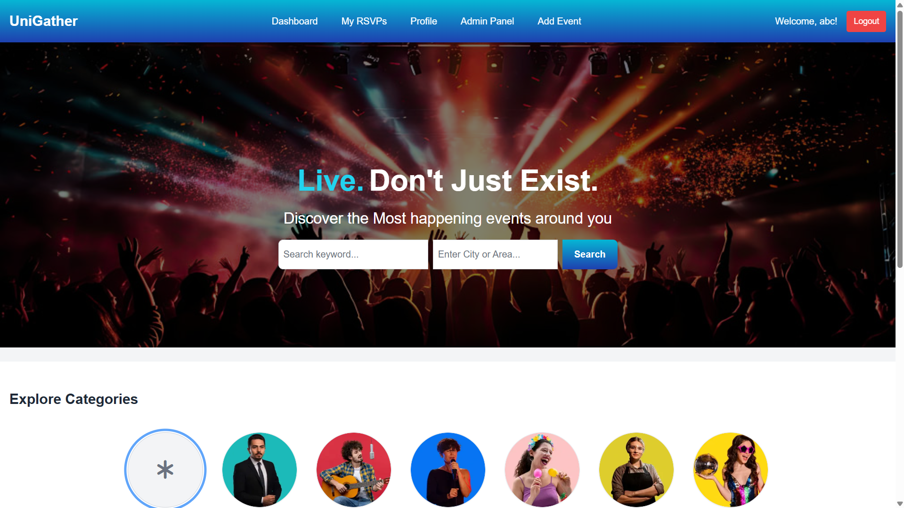
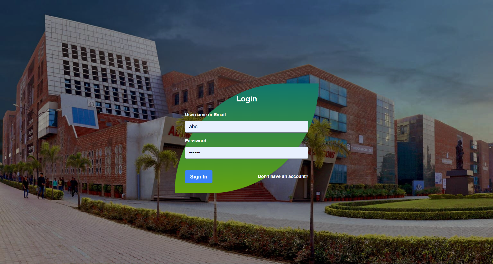
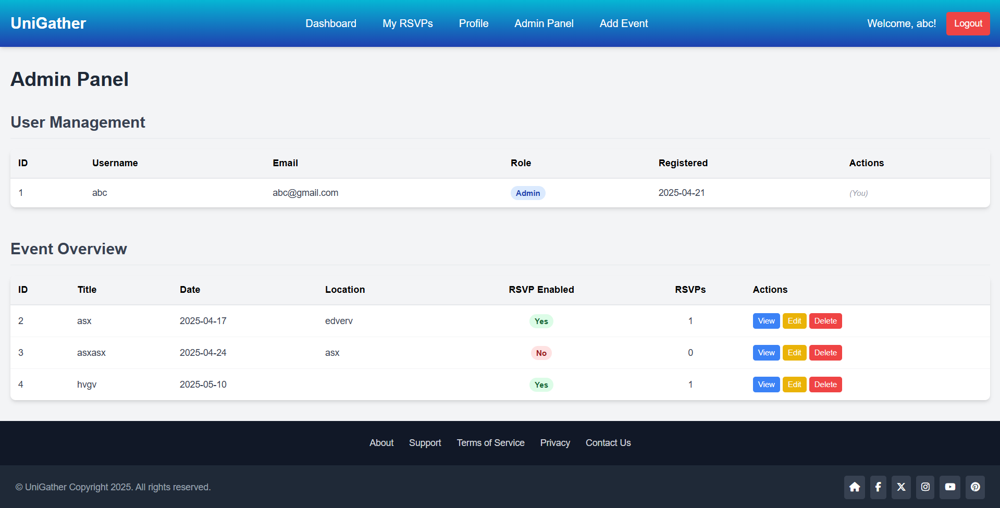

# UniGather - Local Event Calendar

## Description

UniGather is a web-based local event calendar platform built with PHP, MySQL, and Tailwind CSS. It allows users to discover events happening in their area, register for events (RSVP), and provides tools for administrators to manage events and users.

The primary goal is to create a central hub for local event information, connecting event organizers/admins with attendees.

## Technologies Used

* **Backend:** PHP (procedural approach with includes)
* **Database:** MySQL / MariaDB (using PDO for connections)
* **Frontend:** HTML, Tailwind CSS (via CDN)
* **Server Environment:** Assumes a standard local server setup like XAMPP, WAMP, MAMP, or similar LAMP/LEMP stack.

## Features Implemented

* **User Authentication:**
    * User Registration (Signup)
    * User Login
    * User Logout
    * Password Hashing (using `password_hash` and `password_verify`)
    * Session Management
* **User Roles:**
    * Distinction between 'admin' and 'user' roles.
    * Role stored in the database and session.
    * Access control based on roles (e.g., admin-only features).
* **Event Management (Admin Focused):**
    * **Create Events:** Admins can add new events with title, description, date, time, location, category, optional image upload, and an option to enable RSVP. (`add_event.php`)
    * **View Events:** All users can view a list of upcoming events on the dashboard. (`dashboard.php`)
    * **Edit Events:** Admins can edit existing event details (including image, category, and RSVP status). (`edit_event.php`)
    * **Delete Events:** Admins can delete events. (`delete_event.php`)
    * **Single Event View:** Dedicated page to view full details of a single event. (`view_event.php`)
* **User Interaction:**
    * **RSVP System:** Logged-in users can RSVP for events where the feature is enabled. They can also cancel their RSVP. (`handle_rsvp.php`, buttons on dashboard/view pages)
    * **My RSVPs:** Logged-in users can view a list of events they have registered for. (`my_rsvps.php`)
* **Search & Discovery:**
    * **Keyword/Location Search:** Users can search for events based on keywords (matching title/description) and/or location text. (`search_results.php`)
    * **Category Filtering:** Users can filter events displayed on the dashboard by clicking category circles. (`dashboard.php`)
* **Admin Panel:**
    * **User Listing:** Admins can view a table of all registered users with their details (ID, Username, Email, Role, Registration Date). (`admin_panel.php`)
    * **User Role Management:** Admins can promote users to admin or demote admins to user (backend script `change_role.php` created).
    * **User Deletion:** Admins can delete users (backend script `delete_user.php` created). Admins cannot delete themselves.
    * **Event Overview:** Admins can view a list of all events with RSVP counts.
    * **CSRF Protection:** Basic CSRF token implementation for user management actions in the admin panel.
* **User Profile:**
    * Users can view their own profile information (username, email, role, registration date). (`profile.php`)
    * Users can change their own password.
* **Static Pages:**
    * Contact Us page structure. (`contact.php`)
    * Privacy Policy page template. (`privacy.php`)
    * Terms and Conditions page template. (`terms.php`)
    * Support Center page template. (`support.php`)
* **UI:**
    * Basic responsive layout using Tailwind CSS.
    * Reusable header and footer includes.
    * Reusable event card template part.
    * Hero section and category circles display on the dashboard.

## Folder Structure


```text
UniGather/
├── includes/
│   ├── db_connect.php         # Database connection
│   ├── header.php             # Common HTML head, navigation
│   ├── footer.php             # Common HTML footer, JS includes
│   └── template_parts/        # Reusable UI components
│       └── event_card.php     # Template for event display card
│
├── uploads/                   # Directory for user uploads
│   └── event_images/          # Stores uploaded event images (NEEDS WRITE PERMISSIONS)
│
├── add_event.php              # Form/Logic to add new events (Admin)
├── admin_panel.php            # Admin dashboard for user/event management
├── change_role.php            # Backend script for admin changing user roles
├── contact.php                # Contact Us page
├── dashboard.php              # Main event listing/dashboard page
├── delete_event.php           # Backend script for deleting events (Admin)
├── delete_user.php            # Backend script for admin deleting users
├── edit_event.php             # Form/Logic to edit events (Admin)
├── handle_rsvp.php            # Backend script for handling RSVP/Cancel actions
├── index.php                  # Entry point (likely redirects to login/dashboard)
├── login.php                  # Login page and handler
├── logout.php                 # Logout script
├── my_rsvps.php               # Page for users to view their registered events
├── privacy.php                # Privacy Policy page (Template)
├── profile.php                # User profile view/password change page
├── search_results.php         # Displays event search results
├── signup.php                 # Signup page and handler
├── support.php                # Support Center page (Template)
├── terms.php                  # Terms and Conditions page (Template)
└── view_event.php             # Page to view details of a single event
```

## Setup Instructions

1.  **Clone/Download:** Get the project files onto your local machine.
2.  **Web Server:** Place the project folder (e.g., `UniGather/`) inside your web server's document root (e.g., `htdocs` for XAMPP, `www` for WAMP).
3.  **Database Setup:**
    * Using a tool like phpMyAdmin, create a new database (e.g., `event_calendar_db`).
    * Import the provided SQL schema (or manually create the `users`, `events`, and `rsvps` tables).
4.  **Database Configuration:**
    * Open the `includes/db_connect.php` file.
    * Update the `$db_host`, `$db_name`, `$db_user`, and `$db_pass` variables with your actual database credentials.
5.  **Create Upload Directory:**
    * Ensure the `uploads/` folder exists in the project root.
    * Ensure the `uploads/event_images/` folder exists inside `uploads/`.
    * **Crucially:** Make sure your web server (Apache/Nginx user) has **write permissions** for the `uploads/event_images/` directory. This is required for event image uploads to work.
6.  **Initial Admin User (Optional but Recommended):**
    * You can register a user normally through the signup form.
    * Then, manually edit that user's record in the `users` table using phpMyAdmin: change the `role` column value from `user` to `admin`.
7.  **Access the Site:** Open your web browser and navigate to the project directory on your local server (e.g., `http://localhost/UniGather/`). You should be redirected to the login page.


## How to Use

* **Signup:** New users can register via the "Sign Up" link.
* **Login:** Existing users log in with their username/email and password.
* **Dashboard:** After login, users see the main dashboard displaying upcoming events and category circles.
* **Filtering:** Click category circles to filter events. Click "All Events" to clear the filter.
* **Searching:** Use the search bar (keyword and location) in the hero section to find specific events. Results appear on `search_results.php`.
* **View Event:** Click the "View" button on an event card to see its full details on `view_event.php`.
* **RSVP:** If logged in and RSVP is enabled for an event, click "RSVP Now".
* **Cancel RSVP:** On the dashboard or `my_rsvps.php`, click "✓ Going (Cancel)" on an event you've RSVP'd to.
* **My RSVPs:** Logged-in users can click "My RSVPs" in the header to see events they are registered for.
* **Profile:** Logged-in users click "Profile" in the header to view details and change their password.
* **Admin Functions:**
    * Log in as an admin user.
    * Click "Admin Panel" in the header.
    * View users, change roles (promote/demote), or delete users (cannot self-modify/delete).
    * View events with RSVP counts.
    * Click "Add Event" in the header (or on the dashboard) to create new events via `add_event.php`.
    * Click "Edit" or "Delete" on event cards (dashboard/view page) or the event overview table (admin panel) to manage events.

## Screenshots

*(Add screenshots of your application's UI here. Create an `img` or `screenshots` folder in your project, save your images there, and use Markdown image syntax.)*

**Example:**

**Dashboard:**


**Login Page:**


**Admin Panel - User Management:**


*(Replace the paths and descriptions above with your actual screenshots)*

## Remaining Features / Future Enhancements

* **Security:** Implement CSRF protection on all state-changing forms (RSVP, Add/Edit Event, Profile Change Password). Enhance input validation and file upload security.
* **Advanced Search:** Implement more robust location search (e.g., radius search, structured city/state), date range filters, better keyword relevance.
* **RSVP Enhancements:** Display attendee counts, allow organizers to set RSVP limits, potentially add waiting lists or different RSVP types (e.g., "Interested").
* **Category Management:** Allow admins to dynamically add/edit/delete categories via the admin panel instead of using a hardcoded array.
* **User Profile Enhancements:** Allow editing email (with verification), username; display "My Created Events", "My RSVPs".
* **Refactoring:** Continue to improve code quality (e.g., potentially move towards OOP or a micro-framework).
* **Notifications:** Implement email or in-app notifications (e.g., event reminders, new RSVPs for organizers).
* **UI/UX:** Improve visual design, responsiveness, and potentially add JavaScript/AJAX for smoother interactions (e.g., RSVP without page reload).
* **Testing:** Implement unit or integration tests.

